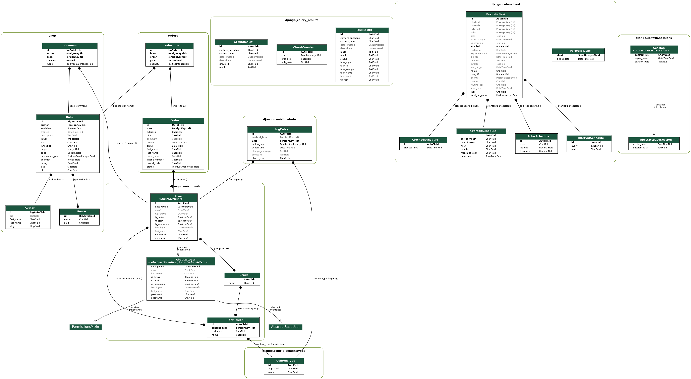

# 📚 Online Bookstore — Graduation Project at Hillel IT School


## 🧰 Technology Stack

- **Back-end:** Django 3.2, Django REST Framework (DRF), Celery, Redis, RabbitMQ  
- **Front-end:** Bootstrap, Ajax  
- **Infrastructure:** Docker, Docker Compose, Nginx  
- **Database:** PostgreSQL  
- **Payment:** Braintree  
- **Email Service:** Mailhog  
- **Architecture:** Microservice-based (Store + Warehouse)

---

## 🛒 Store Features

- 🔄 **Celery** – periodically synchronizes book availability from the warehouse
- 🧺 **Shopping Cart:**
  - Items are stored in the session
  - Users can't add more items than available in stock
- 📦 **Order Placement and Tracking**
- 💳 **Payment via Braintree**
- 📤 **Order transmission to the warehouse API in JSON format**
- 🔍 **Book Search and Genre Filtering**
- 👤 **User Registration and Authentication**
- 📬 **Email Notifications via Mailhog:**
  - When an order is placed
  - When an order is completed
- 💾 **Caching Support**
- 🛠️ **Admin Panel:**
  - Managers can add books and manage orders
- 🔗 **Warehouse API:**
  - Used by the store service to create and retrieve order data

---

## 🚀 Getting Started

1. Clone the repository:

```bash
git clone https://github.com/way2thesky/django_store.git
```

2. Install [Docker](https://docs.docker.com/get-docker/) and [Docker Compose](https://docs.docker.com/compose/install/)

3. Build and run the containers:

```bash
docker-compose build --no-cache
docker-compose up
```

4. Access the app in your browser:
- Store: http://localhost 
- Warehouse (API): http://localhost:8001

---

## 📊 UML Diagram

